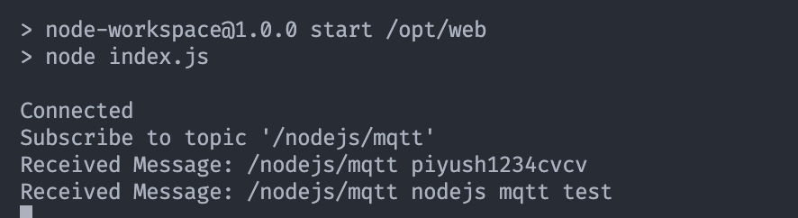
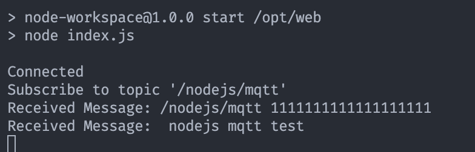
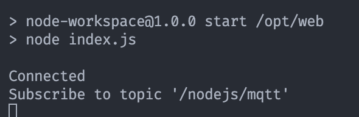
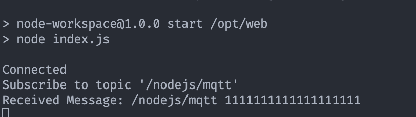

# Start

```
docker build -t mqttjs .
docker run -it --rm --name my-running-app -P  mqttjs
```

# Test Case

### connection mqtt5 props + broker.mqttdashboard.com ☑

```js
const mqtt = require('mqtt')

const host = 'broker.mqttdashboard.com' // or broker.mqttdashboard.com
const port = '8000' // 8000 for broker.mqttdashboard.com
const protocol = 'ws' // ws for broker.mqttdashboard.com
const connectUrl = `${protocol}://${host}:${port}`

const clientId = `mqtt_${Math.random().toString(16).slice(3)}`

const client = mqtt.connect(connectUrl, {
  clientId,
  clean: true,
  connectTimeout: 4000,
  reconnectPeriod: 1000,
  protocolVersion: 5,
  path: '/mqtt', // for broker.mqttdashboard.com
  properties: {
    topicAliasMaximum: 10,
    requestResponseInformation: true,
    requestProblemInformation: true,
  }
})

const topic = '/nodejs/mqtt'

client.on('connect', () => {
  console.log('Connected')
  client.subscribe([topic], () => {
    console.log(`Subscribe to topic '${topic}'`)
    client.publish(topic, 'nodejs mqtt test', {
      qos: 2,
      // properties: {
      //   topicAlias: 'test',
      // },
      retain: false
    }, (error) => {
      if (error) {
        console.error(error)
      }
    })
  })
})

client.on('message', (topic, payload) => {
  console.log('Received Message:', topic, payload.toString())
})
```

result:




### connection mqtt5 props + broker.emqx.io ☑

```js
const mqtt = require('mqtt')

const host = 'broker.emqx.io' // or broker.mqttdashboard.com
const port = '1883' // 8000 for broker.mqttdashboard.com
const protocol = 'mqtt' // ws for broker.mqttdashboard.com
const connectUrl = `${protocol}://${host}:${port}`

const clientId = `mqtt_${Math.random().toString(16).slice(3)}`

const client = mqtt.connect(connectUrl, {
  clientId,
  clean: true,
  connectTimeout: 4000,
  reconnectPeriod: 1000,
  protocolVersion: 5,
  // path: '/mqtt', // for broker.mqttdashboard.com
  properties: {
    topicAliasMaximum: 10,
    requestResponseInformation: true,
    requestProblemInformation: true,
  }
})

const topic = '/nodejs/mqtt'

client.on('connect', () => {
  console.log('Connected')
  client.subscribe([topic], () => {
    console.log(`Subscribe to topic '${topic}'`)
    client.publish(topic, 'nodejs mqtt test', {
      qos: 2,
      // properties: {
      //   topicAlias: 'test',
      // },
      retain: false
    }, (error) => {
      if (error) {
        console.error(error)
      }
    })
  })
})

client.on('message', (topic, payload) => {
  console.log('Received Message:', topic, payload.toString())
})
```

result:




### connection mqtt5 props + publish mqtt5 props + broker.mqttdashboard.com ❎

```js
const mqtt = require('mqtt')

const host = 'broker.mqttdashboard.com' // or broker.mqttdashboard.com
const port = '8000' // 8000 for broker.mqttdashboard.com
const protocol = 'ws' // ws for broker.mqttdashboard.com
const connectUrl = `${protocol}://${host}:${port}`

const clientId = `mqtt_${Math.random().toString(16).slice(3)}`

const client = mqtt.connect(connectUrl, {
  clientId,
  clean: true,
  connectTimeout: 4000,
  reconnectPeriod: 1000,
  protocolVersion: 5,
  path: '/mqtt', // for broker.mqttdashboard.com
  properties: {
    topicAliasMaximum: 10,
    requestResponseInformation: true,
    requestProblemInformation: true,
  }
})

const topic = '/nodejs/mqtt'

client.on('connect', () => {
  console.log('Connected')
  client.subscribe([topic], () => {
    console.log(`Subscribe to topic '${topic}'`)
    client.publish(topic, 'nodejs mqtt test', {
      qos: 2,
      properties: {
        topicAlias: 'test',
      },
      retain: false
    }, (error) => {
      if (error) {
        console.error(error)
      }
    })
  })
})

client.on('message', (topic, payload) => {
  console.log('Received Message:', topic, payload.toString())
})
```




### connection mqtt5 props + publish mqtt5 props + broker.emqx.io ❎

```js
const mqtt = require('mqtt')

const host = 'broker.emqx.io' // or broker.mqttdashboard.com
const port = '1883' // 8000 for broker.mqttdashboard.com
const protocol = 'mqtt' // ws for broker.mqttdashboard.com
const connectUrl = `${protocol}://${host}:${port}`

const clientId = `mqtt_${Math.random().toString(16).slice(3)}`

const client = mqtt.connect(connectUrl, {
  clientId,
  clean: true,
  connectTimeout: 4000,
  reconnectPeriod: 1000,
  protocolVersion: 5,
  // path: '/mqtt', // for broker.mqttdashboard.com
  properties: {
    topicAliasMaximum: 10,
    requestResponseInformation: true,
    requestProblemInformation: true,
  }
})

const topic = '/nodejs/mqtt'

client.on('connect', () => {
  console.log('Connected')
  client.subscribe([topic], () => {
    console.log(`Subscribe to topic '${topic}'`)
    client.publish(topic, 'nodejs mqtt test', {
      qos: 2,
      properties: {
        topicAlias: 'test',
      },
      retain: false
    }, (error) => {
      if (error) {
        console.error(error)
      }
    })
  })
})

client.on('message', (topic, payload) => {
  console.log('Received Message:', topic, payload.toString())
})
```

result:

